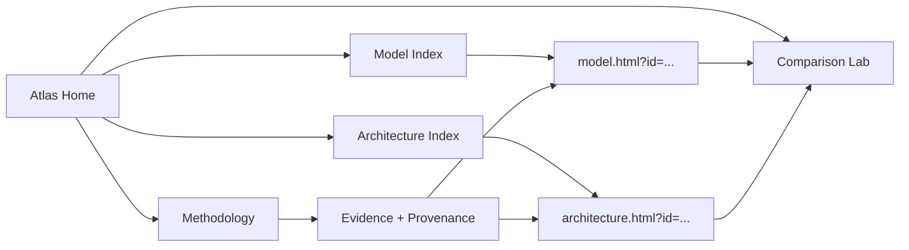

# Foundation Model Atlas

<p align="center">
  <strong>An interactive, evidence-aware atlas of foundation models and their architectures.</strong><br>
  Explore models · map architectures · trace lineage · compare structures · inspect evidence
</p>

<p align="center">
  <a href="https://rahulkiran2222.github.io/foundation-model-atlas/"></a>
  <a href="https://github.com/rahulkiran2222/foundation-model-atlas"></a>
  
  
</p>

<p align="center">
  <a href="https://rahulkiran2222.github.io/foundation-model-atlas/">Live Demo</a> ·
  <a href="https://rahulkiran2222.github.io/foundation-model-atlas/models.html">Models</a> ·
  <a href="https://rahulkiran2222.github.io/foundation-model-atlas/architectures.html">Architectures</a> ·
  <a href="https://rahulkiran2222.github.io/foundation-model-atlas/compare.html">Comparison Lab</a> ·
  <a href="https://rahulkiran2222.github.io/foundation-model-atlas/methodology.html">Methodology</a>
</p>

---

## ✦ The idea

Foundation-model directories usually answer **“what models exist?”**

The **Foundation Model Atlas** asks a broader question:

> **What is the model, how is it built, how does it relate to other models, and what evidence supports the record?**

The Atlas is designed as a **research-oriented, data-driven interface** rather than a static list of model names.

### The Atlas connects

```text
                         FOUNDATION MODEL ATLAS
                                  │
             ┌────────────────────┼────────────────────┐
             ▼                    ▼                    ▼
        MODEL RECORDS       ARCHITECTURE          EVIDENCE
             │                 RECORDS                │
             ▼                    ▼                    ▼
        identity · size     mechanisms · flow     papers · cards
        modalities          attention · MoE      repos · docs
        release · links     sequence · fusion    provenance
             │                    │                    │
             └────────────────────┼────────────────────┘
                                  ▼
                         COMPARISON LAB
                                  │
                                  ▼
                         STRUCTURAL INSIGHT
```

---

## 🧭 Atlas map

| Surface | Purpose |
|---|---|
| **`index.html`** | Main Atlas command center and project overview |
| **`models.html`** | Search and browse model records |
| **`model.html?id=...`** | Individual model record |
| **`architectures.html`** | Architecture Index |
| **`architecture.html?id=...`** | Individual architecture record |
| **`compare.html`** | Interactive model/architecture Comparison Lab |
| **`methodology.html`** | Evidence, provenance, normalization and research protocol |
| **`data/*.json`** | Canonical structured records |

### Navigation



---

## 🔬 What makes it different

### 01 — Architecture-first

Models are not treated as isolated names.

The Atlas connects models to architectural concepts such as:

- Transformer blocks
- attention variants
- mixture-of-experts routing
- state-space / sequence mechanisms
- positional strategies
- multimodal interfaces
- efficient attention
- hybrid designs
- model-specific components

### 02 — Evidence-aware

The Atlas distinguishes:

```text
DOCUMENTED
    ↓
directly supported by source

NORMALIZED
    ↓
same fact represented consistently

INFERRED
    ↓
reasoned interpretation, explicitly marked

UNAVAILABLE
    ↓
no supported public value
```

> **Evidence before certainty.**

### 03 — Data-driven

HTML pages are presentation layers.

The structured records are the underlying source of truth:

```text
JSON records
    ↓
Model / Architecture pages
    ↓
Search + filters
    ↓
Comparison
    ↓
Visual explanations
```

### 04 — Comparison as a first-class operation

Instead of reading two model pages separately, the Comparison Lab turns structural differences into a visual research interface:

```text
MODEL A                         MODEL B
   │                               │
   ├── attention                   ├── attention
   ├── routing                     ├── routing
   ├── sequence mechanism          ├── sequence mechanism
   └── parameter regime            └── parameter regime
             ╲                   ╱
              ╲                 ╱
               ─ COMPARISON ───
                    │
                    ▼
             STRUCTURAL DIFFERENCE
```

---

## 🧩 Architecture philosophy

The Atlas intentionally distinguishes **conceptual architecture** from **exact implementation topology**.

A diagram can explain a model without claiming undocumented details.

```text
Input
  │
  ▼
Embedding
  │
  ▼
Sequence Engine
  ├── Attention
  ├── State-space
  └── Hybrid
  │
  ▼
Feed-forward / Experts
  │
  ▼
Output
```

This is a **conceptual map**, not a claim that every model contains exactly these modules in this exact order.

That distinction is central to the project.

---

## 📚 Evidence hierarchy

The Atlas prioritizes evidence approximately in this order:

1. **Original technical paper / technical report**
2. **Official model card / release documentation**
3. **Official repository / implementation**
4. **Official configuration or weights artifacts**
5. **Official benchmark / evaluation material**
6. **Reputable secondary research**

A source supporting one field does not automatically validate every field in a record.

---

## 🧬 Model lineage

The Atlas treats:

**family ≠ model ≠ version ≠ variant**

```text
MODEL FAMILY
     │
     ├── Generation 1
     │     ├── small variant
     │     └── large variant
     │
     ├── Generation 2
     │     ├── base
     │     ├── reasoning
     │     └── specialized
     │
     └── Generation 3
           └── new architecture / configuration
```

Family relationships connect related releases while preserving individual model identity.

---

## 🗃️ Data model

A simplified model record:

```json
{
  "id": "example-model",
  "name": "Example Model",
  "organization": "Organization",
  "releaseDate": "YYYY-MM-DD",
  "parameters": {
    "total": null,
    "active": null
  },
  "architecture": {
    "id": "example-architecture"
  },
  "modalities": [],
  "sources": []
}
```

A simplified architecture record:

```json
{
  "id": "example-architecture",
  "name": "Example Architecture",
  "family": "Transformer",
  "coreMechanism": "Documented mechanism",
  "attention": null,
  "routing": null,
  "sequenceModeling": null,
  "models": [],
  "sources": []
}
```

These examples are illustrative. The project's canonical JSON remains authoritative.

---

## ⚙️ Repository structure

```text
foundation-model-atlas/
│
├── index.html
├── models.html
├── model.html
├── architectures.html
├── architecture.html
├── compare.html
├── methodology.html
│
└── data/
    ├── models.json
    ├── architectures.json
    └── supporting source data
```

---

## 🚀 Run locally

The Atlas loads JSON through browser `fetch()`, so use a local HTTP server instead of opening `index.html` directly with `file://`.

```bash
git clone https://github.com/rahulkiran2222/foundation-model-atlas.git
cd foundation-model-atlas
python3 -m http.server 8000
```

Then open:

```text
http://localhost:8000/
```

---

## 🧪 Quality principles

- **Primary evidence first**
- **Facts before inference**
- **Unknown is better than fabricated**
- **One canonical record per entity**
- **Architecture claims require architectural evidence**
- **Comparison should preserve uncertainty**
- **Visuals explain; sources support**
- **Historical lineage should not be erased by new releases**

---

## 📐 Parameter conventions

Parameter counts require context, particularly for sparse / MoE systems.

| Term | Meaning |
|---|---|
| **Total parameters** | All stored parameters |
| **Active parameters** | Parameters participating in a typical token's computation |
| **A/B notation** | Source-specific shorthand that must be interpreted from the originating documentation |
| **Variant** | A distinct released model configuration or size |

The Atlas does not assume that every `A/B` notation means exactly the same thing across every source.

---

## 🛡️ Uncertainty and limitations

Public technical information is uneven.

Some organizations publish detailed technical reports and configurations; others publish only high-level descriptions. Closed models can have particularly limited architectural transparency.

Therefore:

> **Database completeness does not imply completeness of public knowledge.**

If evidence does not support a reliable value, the Atlas should preserve the unknown rather than invent precision.

---

## 🛠️ Current status

### Foundation Model Atlas — v0.1.0

```text
BUILD             ████████████████████████████████
DATA              ████████████████████████████████
ARCHITECTURE      ████████████████████████████████
VISUALIZATION     ████████████████████████████████
COMPARISON        ████████████████████████████████
METHODOLOGY       ████████████████████████████████
DEPLOYMENT        ████████████████████████████████
```

### v0.1 includes

- [x] Model Index
- [x] Individual Model Records
- [x] Architecture Index
- [x] Individual Architecture Records
- [x] Interactive architecture visualization
- [x] Comparison Lab
- [x] Data-driven JSON architecture
- [x] Model ↔ architecture relationships
- [x] Evidence and provenance methodology
- [x] Animated Atlas homepage
- [x] Responsive interface
- [x] GitHub Pages deployment

---

## 🗺️ Roadmap

### v0.1 — Foundation

- [x] Model database
- [x] Architecture database
- [x] Model explorer
- [x] Architecture explorer
- [x] Individual records
- [x] Interactive comparison
- [x] Methodology
- [x] Provenance structure
- [x] Deployment

### v0.2 — Research layer

Potential future work:

- [ ] richer lineage graphs
- [ ] architecture evolution timelines
- [ ] stronger source-audit tooling
- [ ] quantitative architecture statistics
- [ ] automated record validation
- [ ] downloadable research datasets
- [ ] citation/export tooling

### Long-term

The goal is not simply **more model names**.

It is a research interface for studying:

> **how foundation-model architectures evolve, converge, diverge and scale.**

---

## 📖 Methodology

Read the full research protocol:

**[`methodology.html`](https://rahulkiran2222.github.io/foundation-model-atlas/methodology.html)**

It defines:

- record identity
- evidence hierarchy
- certainty states
- architecture representation
- parameter conventions
- family and lineage rules
- provenance
- comparison rules
- deduplication
- update policy
- limitations

---

## 🌐 Links

- **Live Atlas:** https://rahulkiran2222.github.io/foundation-model-atlas/
- **Model Index:** https://rahulkiran2222.github.io/foundation-model-atlas/models.html
- **Architecture Index:** https://rahulkiran2222.github.io/foundation-model-atlas/architectures.html
- **Comparison Lab:** https://rahulkiran2222.github.io/foundation-model-atlas/compare.html
- **Methodology:** https://rahulkiran2222.github.io/foundation-model-atlas/methodology.html

---

## 👤 Author

**Rahul Kiran Gunti**

Foundation Model Atlas · v0.1.0

<p align="center">
  <strong>Explore the models. Understand the architecture. Follow the evidence.</strong>
</p>
